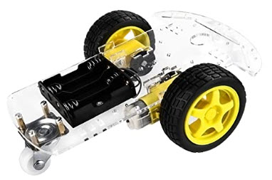
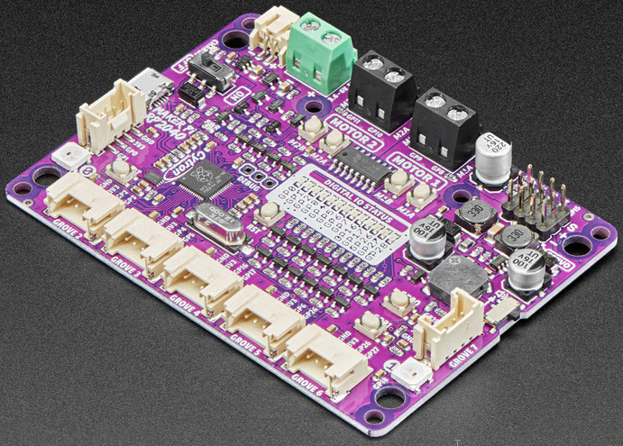
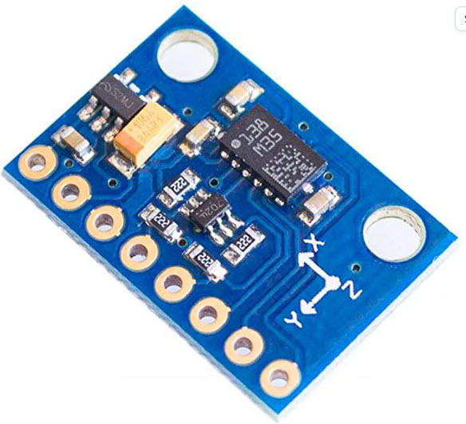
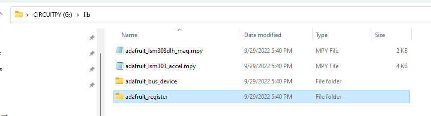
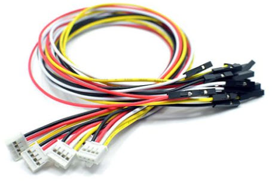
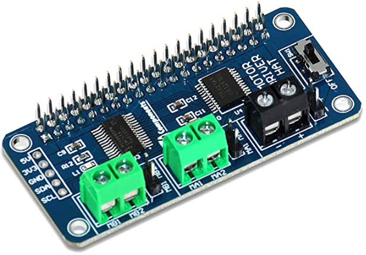
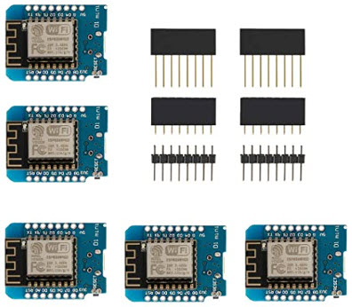
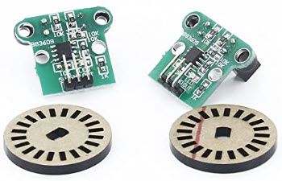

# robots-compass-bot

Experiments with a Compass Module

## Hardware

### Two wheel robot base ($13)
https://www.amazon.com/dp/B01LXY7CM3



### Robot control board ($15)
https://www.adafruit.com/product/5129



https://github.com/CytronTechnologies/MAKER-PI-RP2040

Writeable filesystem:

https://learn.adafruit.com/circuitpython-essentials/circuitpython-storage

### Compass module LSM303DLHC ($8)
https://www.amazon.com/HiLetgo-LSM303DLHC-Compass-Accelerometer-Magnetometer/dp/B07X3GFKYD



```
>>> import machine
>>> i2c = machine.I2C(scl=machine.Pin(5), sda=machine.Pin(4))
>>> i2c.scan()
[25, 30]
>>>
```

!(https://www.st.com/resource/en/datasheet/lsm303dlhc.pdf)[https://www.st.com/resource/en/datasheet/lsm303dlhc.pdf]



Hex 19: 00011001 (Linear acceleration)

Hex 1E: 00011110 (Compass)

https://github.com/adafruit/Adafruit_CircuitPython_LSM303DLH_Mag

## Other Hardware Options

### More grove connector wires ($3.50 for 5)
https://www.seeedstudio.com/Grove-4-pin-Female-Jumper-to-Grove-4-pin-Conversion-Cable-5-PCs-per-PAck.html



### Raspberry Pi motor hat (can be used as generic I2C motor driver without a pi) ($18)
https://www.amazon.com/dp/B098B1P8BS 

The power switch: connects the VIN terminals to the board. The "OFF" position connects VIN, the "ON" position does not. Seems backwards. Might be related to getting power from the pi instead.

The edge of the board has header holes for:
  * 5V connects to the board's 5V regulator output to the raspberry pi's 5V pin
  * 3.3V does NOT connect to the raspberry pi's 3V pin since the Pi drives this
  * GND connects to common ground on board and pi
  * SCL and SDA connect to PI pins 

With the ESP8266. D1 wired to SCL, D2 wired to SDA. An I2C scan reboots the ESP. Other devices scan correctly from the ESP. Very odd. 

Trying from the Pi: i2cdetect shows addresses 40 and 70. Seems to work from the pi.



### ESP8266 ($16 for five)
https://www.amazon.com/dp/B073CQVFLK 



### Wheel encoder readers (for future projects) ($9 for the pair)
https://www.amazon.com/dp/B00EERJDY4 



## 3D point plotter

```

# py -m pip install matplotlib

import json
with open('data.txt') as f:
    data = json.load(f)

import matplotlib.pyplot as plt
fig = plt.figure()
ax = plt.axes(projection='3d',xlabel='X',ylabel='Y',zlabel='Z',title='Compass Spin')

ax.scatter3D(0,0,0,c='blue',s=100)

plt.show()
```