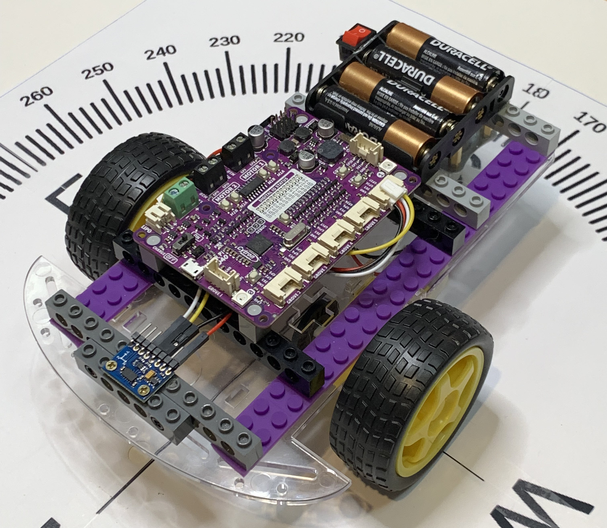
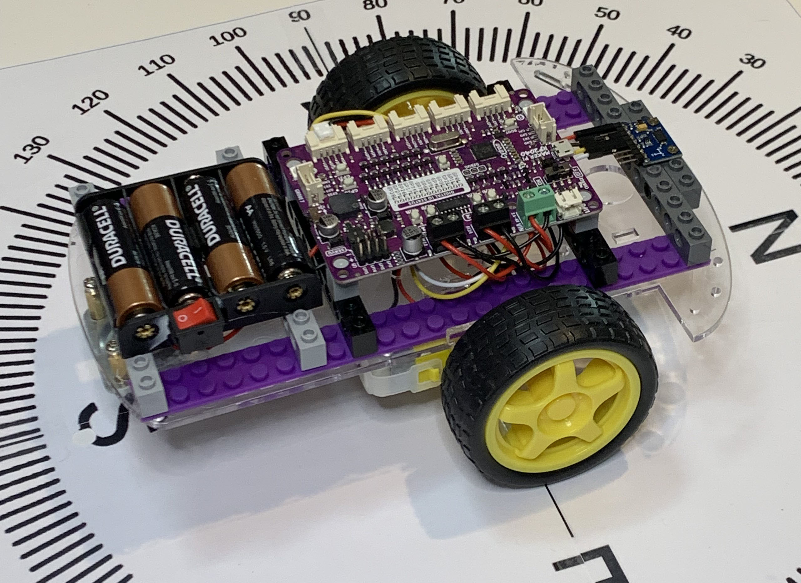
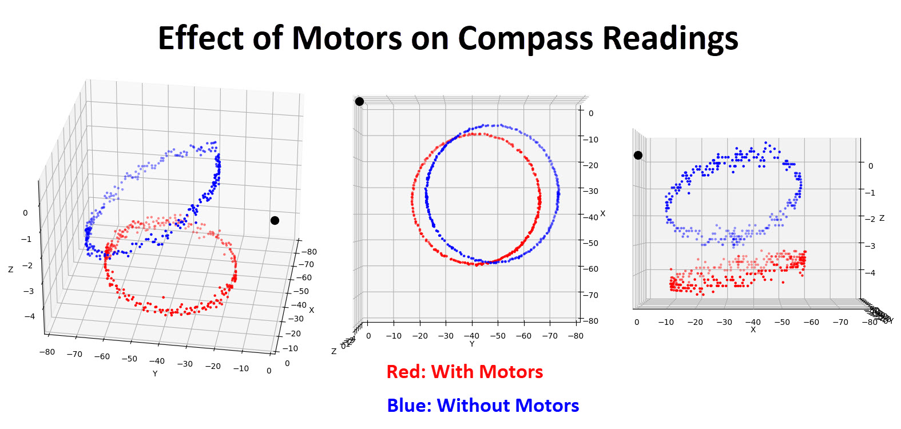
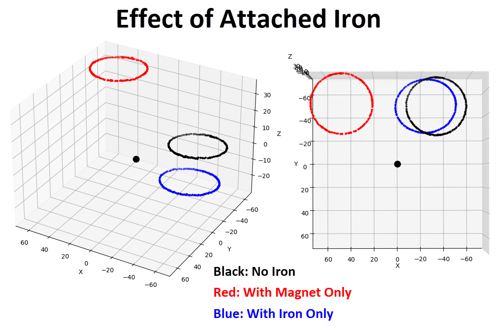
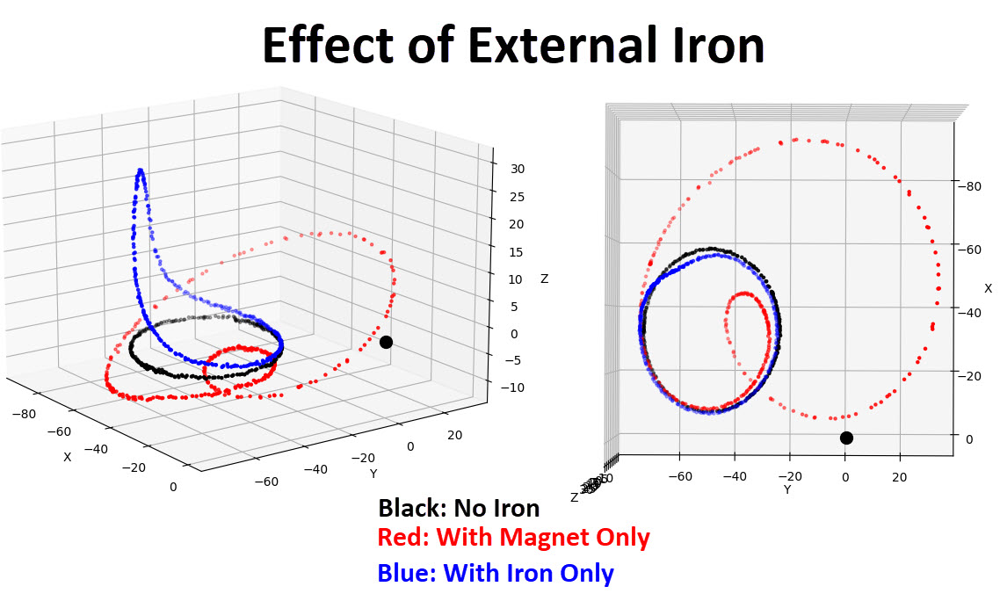
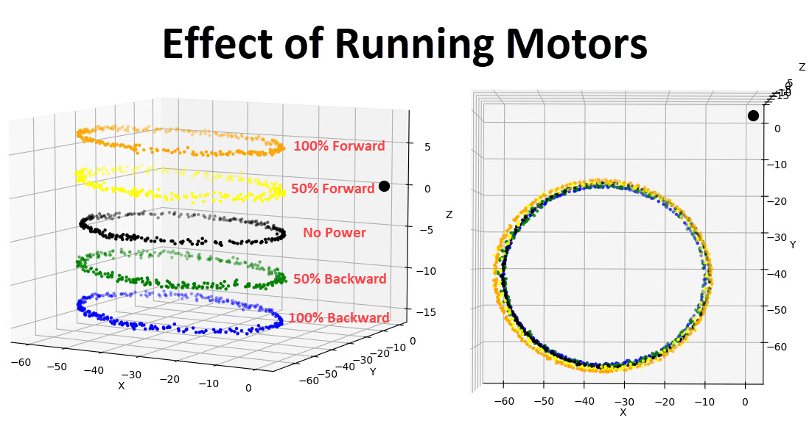
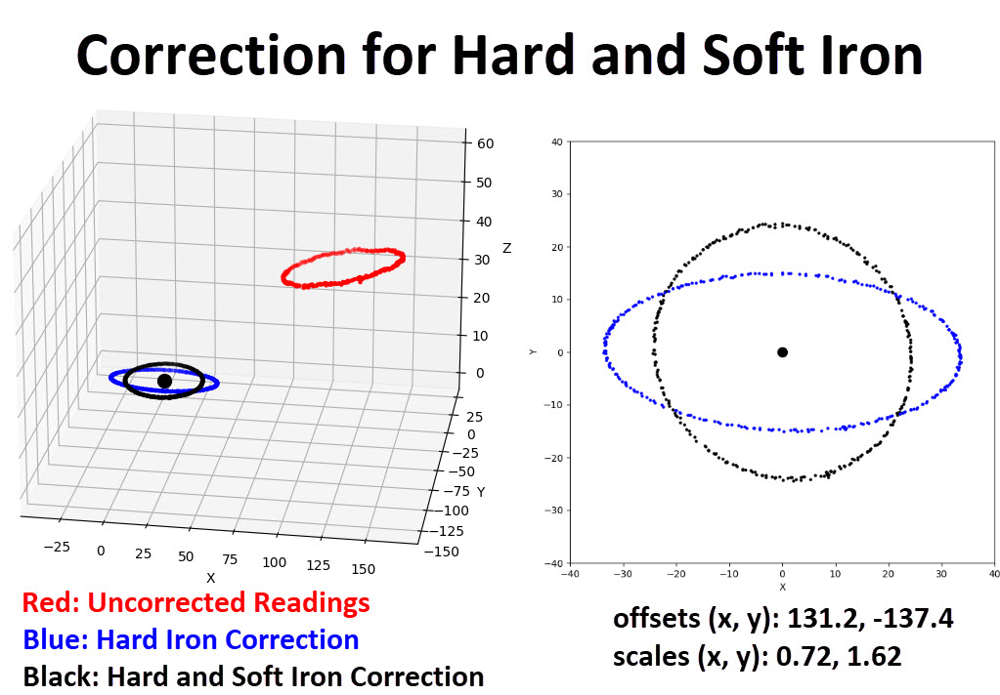

# robots-compass-bot

Experiments with a Compass Module





## Hardware

### Two wheel robot base ($13)
https://www.amazon.com/dp/B01LXY7CM3


### Robot control board ($15)
https://www.adafruit.com/product/5129


https://github.com/CytronTechnologies/MAKER-PI-RP2040

Writeable filesystem:

https://learn.adafruit.com/circuitpython-essentials/circuitpython-storage

### Compass module LSM303DLHC ($8)
https://www.amazon.com/HiLetgo-LSM303DLHC-Compass-Accelerometer-Magnetometer/dp/B07X3GFKYD


```
>>> import machine
>>> i2c = machine.I2C(scl=machine.Pin(5), sda=machine.Pin(4))
>>> i2c.scan()
[25, 30]
>>>
```

!(https://www.st.com/resource/en/datasheet/lsm303dlhc.pdf)[https://www.st.com/resource/en/datasheet/lsm303dlhc.pdf]


Hex 19: 00011001 (Linear acceleration)

Hex 1E: 00011110 (Compass)

https://github.com/adafruit/Adafruit_CircuitPython_LSM303DLH_Mag

## Other Hardware Options

### More grove connector wires ($3.50 for 5)
https://www.seeedstudio.com/Grove-4-pin-Female-Jumper-to-Grove-4-pin-Conversion-Cable-5-PCs-per-PAck.html


### Raspberry Pi motor hat (can be used as generic I2C motor driver without a pi) ($18)
https://www.amazon.com/dp/B098B1P8BS 

The power switch: connects the VIN terminals to the board. The "OFF" position connects VIN, the "ON" position does not. Seems backwards. Might be related to getting power from the pi instead.

The edge of the board has header holes for:
  * 5V connects to the board's 5V regulator output to the raspberry pi's 5V pin
  * 3.3V does NOT connect to the raspberry pi's 3V pin since the Pi drives this
  * GND connects to common ground on board and pi
  * SCL and SDA connect to PI pins 

With the ESP8266. D1 wired to SCL, D2 wired to SDA. An I2C scan reboots the ESP. Other devices scan correctly from the ESP. Very odd. 

Trying from the Pi: i2cdetect shows addresses 40 and 70. Seems to work from the pi.


### ESP8266 ($16 for five)
https://www.amazon.com/dp/B073CQVFLK 


### Wheel encoder readers (for future projects) ($9 for the pair)
https://www.amazon.com/dp/B00EERJDY4 


## 3D point plotter

```

# py -m pip install matplotlib

import json
with open('data.txt') as f:
    data = json.load(f)

import matplotlib.pyplot as plt
fig = plt.figure()
ax = plt.axes(projection='3d',xlabel='X',ylabel='Y',zlabel='Z',title='Compass Spin')

ax.scatter3D(0,0,0,c='blue',s=100)

plt.show()
```

## Graphs

These graphs were made by spinning the compass module in a circle about the gravity vector. The Z axis of
the compass is parallel to gravity. The (x, y) plane is parallel to the Earth.

### With and without motors
Made with `plot_base.py`.

The motors have magnets (and iron) in them. How do the motors affect the compass reading? Let's spin the
compass/controller/batteries with and without the robot base attached.



Interestingly, the motors bend the readings closer to ideal (zero slope in Z).

### Magnet and iron mounted to robot
Made with `plot_mounted.py`.

How does a magnet attached to the robot affect the compass readings? How does a chunk of iron attached to
the robot affect the compass readings? Let's spin compass/controller/batteries with iron attached.



With no magnet and no iron, the readings (black curve) are offset from center. This is caused by hard and soft
iron built into the compass/controller/batteries. Mounting screws and header pins contribute to this offset.

The magnet pushes the readings (red curve) away from the origin. The iron (blue curve) does too, but less noticeably.

### Magnet and iron external to robot
Made with `plot_externals.py`.

How does a magnet placed near the robot (but not attached) affect the compass readings? How does a chunk of iron
placed near the robot (but not attached) affect the compass readings?



The iron I used is a square tube stood upright along the Z axis. Notice how the blue curve is distorted along the Z axis.

The magnet wreaks havoc with the readings (red curve).

### Running motors
Made with `plot_motors.py`.

When a motor is running, the current creates an electromagnet within each motor. Does this affect the compass readings?

Let's run the motors at full and half power both backwards and forwards.



The Z-axises of these curves have been tweaked to separate the curves visually. Just looking at the (x, y) values we find that
all of the curves are nearly identical. The readings are affected the same whether the motors are running or not.

### Calibration
Made with `calibrate.py`

The Z slope is slight. We will ignore the compass readings on the Z axis. The (x, y) offsets are easy to calculate and adjust for.
The distortion, or squashing, of the circle by soft-iron is harder to correct for. We'll use the "simple" correction factor because
it is computationally cheap.



Notice that the final (black) curve is not a perfect circle. The "simple" correction algorithm leaves a little error, but it is close
enough to perfect for our use.